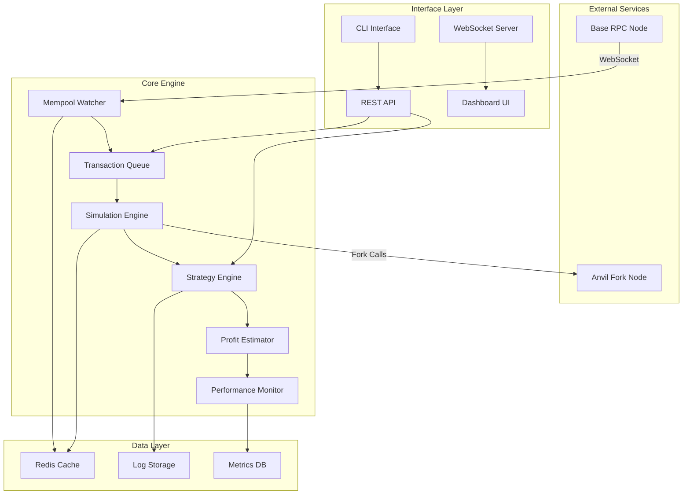
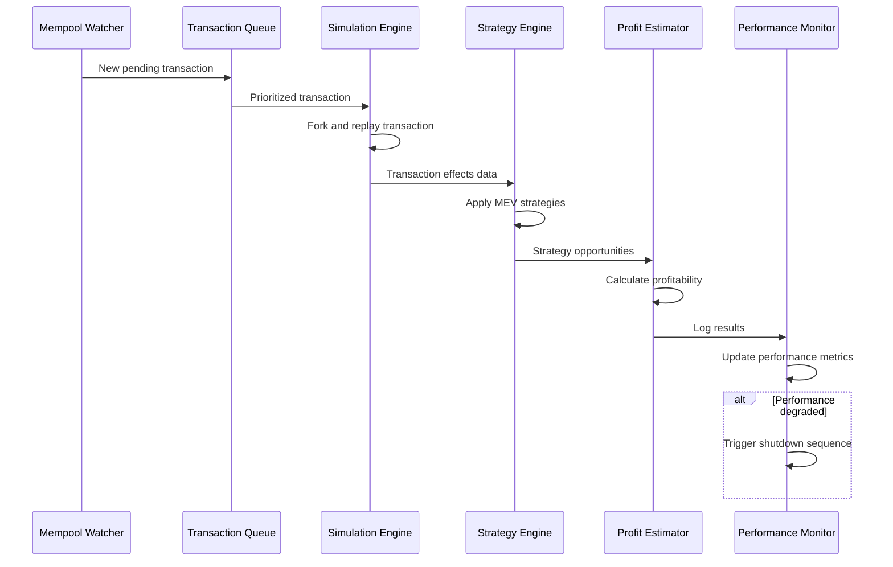

# Design Document

## Overview

The L2 MEV Strategy Engine is a high-performance, real-time system designed to detect and analyze Maximum Extractable Value (MEV) opportunities on Base Layer 2 network. The system follows a microservices architecture with distinct components for mempool monitoring, transaction simulation, strategy detection, and execution planning.

The engine operates by continuously monitoring the Base mempool via WebSocket connections, maintaining an in-memory transaction queue, simulating transaction effects on a forked EVM environment, and applying various MEV detection strategies (sandwich, backrun, frontrun, time bandit) to identify profitable opportunities.

## Architecture

### High-Level Architecture



### Component Interaction Flow



## Components and Interfaces

### Mempool Watcher

**Responsibility**: Monitor Base network mempool and stream pending transactions

**Key Interfaces**:
- `WebSocketConnection`: Manages connection to Base RPC WebSocket endpoint
- `TransactionStream`: Processes incoming transaction data
- `ConnectionManager`: Handles reconnection logic with exponential backoff

**Implementation Details**:
- Establishes WebSocket connection to `wss://mainnet.base.org` or similar RPC endpoint
- Subscribes to `eth_subscribe("newPendingTransactions")` 
- Implements connection pooling for redundancy
- Maintains connection health monitoring with automatic failover

### Transaction Queue

**Responsibility**: Maintain prioritized in-memory queue of pending transactions

**Key Interfaces**:
- `PriorityQueue`: Gas price and nonce-based transaction ordering
- `TransactionFilter`: Filters transactions by relevance criteria
- `QueueManager`: Manages queue size and eviction policies

**Implementation Details**:
- Uses heap-based priority queue ordered by gas price
- Implements LRU eviction when queue exceeds capacity (10,000 transactions)
- Filters transactions by minimum gas price and contract interaction patterns
- Maintains separate queues for different transaction types (swaps, transfers, etc.)

### Simulation Engine

**Responsibility**: Replay transactions on forked EVM environment and measure effects

**Key Interfaces**:
- `ForkManager`: Manages Anvil fork instances
- `TransactionReplayer`: Executes transactions on fork
- `StateAnalyzer`: Measures pre/post transaction state changes

**Implementation Details**:
- Spawns Anvil instances with `--fork-url https://mainnet.base.org`
- Maintains pool of fork instances for parallel processing
- Captures token balances, DEX pool states, and event logs
- Implements transaction batching for efficiency
- Handles fork state reset and cleanup

### Strategy Engine

**Responsibility**: Detect MEV opportunities using various strategies

**Key Interfaces**:
- `SandwichDetector`: Identifies sandwich attack opportunities
- `BackrunDetector`: Finds arbitrage opportunities from price gaps
- `FrontrunDetector`: Detects frontrunnable high-value transactions
- `TimeBanditDetector`: Analyzes transaction reordering opportunities

**Strategy Implementations**:

**Sandwich Strategy**:
- Monitors large swap transactions (>$10k value)
- Checks slippage tolerance (<2% for profitability)
- Constructs front-run transaction with +10% gas price
- Constructs back-run transaction to capture price difference

**Backrun Strategy**:
- Detects price discrepancies between DEX pools
- Calculates optimal arbitrage trade size using binary search
- Accounts for gas costs and slippage in profit calculation

**Frontrun Strategy**:
- Identifies high-value transactions with predictable price impact
- Constructs similar transaction with higher gas price (+20-50%)
- Validates that frontrun execution remains profitable

**Time Bandit Strategy**:
- Analyzes sets of related pending transactions
- Uses constraint solver to find optimal transaction ordering
- Validates transaction dependencies and nonce requirements

### Profit Estimator

**Responsibility**: Calculate expected profitability for detected opportunities

**Key Interfaces**:
- `ProfitCalculator`: Core profit calculation logic
- `GasEstimator`: Estimates gas costs for strategy execution
- `SlippageCalculator`: Models price impact and slippage

**Implementation Details**:
- Factors in gas costs, slippage, and execution probability
- Uses historical data to calibrate profit models
- Implements Monte Carlo simulation for risk assessment
- Maintains profitability thresholds per strategy type

### Performance Monitor

**Responsibility**: Track system performance and implement safety mechanisms

**Key Interfaces**:
- `MetricsCollector`: Collects performance and profitability metrics
- `AlertManager`: Manages alerts and notifications
- `ShutdownManager`: Implements automatic shutdown logic

**Implementation Details**:
- Tracks rolling windows of trade profitability (50, 100, 500 trades)
- Implements circuit breaker pattern for automatic shutdown
- Monitors system latency and throughput metrics
- Provides Prometheus metrics endpoint for external monitoring

## Data Models

### Transaction Model
```go
type Transaction struct {
    Hash        string    `json:"hash"`
    From        string    `json:"from"`
    To          string    `json:"to"`
    Value       *big.Int  `json:"value"`
    GasPrice    *big.Int  `json:"gasPrice"`
    GasLimit    uint64    `json:"gasLimit"`
    Nonce       uint64    `json:"nonce"`
    Data        []byte    `json:"data"`
    Timestamp   time.Time `json:"timestamp"`
}
```

### MEV Opportunity Model
```go
type MEVOpportunity struct {
    ID              string           `json:"id"`
    Strategy        StrategyType     `json:"strategy"`
    TargetTx        string           `json:"target_tx"`
    ExpectedProfit  *big.Int         `json:"expected_profit"`
    GasCost         *big.Int         `json:"gas_cost"`
    NetProfit       *big.Int         `json:"net_profit"`
    Confidence      float64          `json:"confidence"`
    Status          OpportunityStatus `json:"status"`
    CreatedAt       time.Time        `json:"created_at"`
    ExecutionTxs    []Transaction    `json:"execution_txs"`
}
```

### Performance Metrics Model
```go
type PerformanceMetrics struct {
    WindowSize      int       `json:"window_size"`
    TotalTrades     int       `json:"total_trades"`
    ProfitableTrades int      `json:"profitable_trades"`
    LossRate        float64   `json:"loss_rate"`
    AvgLatency      time.Duration `json:"avg_latency"`
    TotalProfit     *big.Int  `json:"total_profit"`
    LastUpdated     time.Time `json:"last_updated"`
}
```

## Error Handling

### Connection Resilience
- WebSocket connections implement exponential backoff reconnection
- Multiple RPC endpoints configured for failover
- Circuit breaker pattern prevents cascade failures

### Simulation Failures
- Fork failures trigger automatic fork recreation
- Transaction replay errors are logged and skipped
- Simulation timeouts prevent resource exhaustion

### Strategy Errors
- Invalid opportunities are filtered out before profit calculation
- Strategy exceptions are caught and logged without system impact
- Malformed transaction data triggers graceful degradation

### Performance Degradation
- Automatic shutdown when loss rates exceed thresholds
- Alert notifications before reaching critical thresholds
- Manual override capabilities for emergency situations

## Testing Strategy

### Unit Testing
- Individual component testing with mocked dependencies
- Strategy algorithm testing with synthetic transaction data
- Profit calculation validation with known scenarios

### Integration Testing
- End-to-end testing with testnet environments
- WebSocket connection resilience testing
- Fork management and cleanup testing

### Performance Testing
- Load testing with high-frequency transaction streams
- Latency benchmarking for simulation and strategy detection
- Memory usage profiling under sustained load

### Regression Testing
- Historical transaction replay for strategy validation
- Profitability model accuracy testing
- Performance metric consistency validation

### Security Testing
- Input validation for all external data sources
- Rate limiting and DoS protection testing
- Private key and sensitive data handling validation

## Deployment Architecture

### Container Strategy
```yaml
services:
  mempool-watcher:
    image: mev-engine/mempool-watcher
    environment:
      - BASE_RPC_URL=wss://mainnet.base.org
    restart: always
    
  simulation-engine:
    image: mev-engine/simulation-engine
    environment:
      - ANVIL_FORK_URL=https://mainnet.base.org
    restart: always
    
  strategy-engine:
    image: mev-engine/strategy-engine
    depends_on:
      - redis
      - postgres
    restart: always
    
  dashboard:
    image: mev-engine/dashboard
    ports:
      - "3000:3000"
    restart: always
```

### Monitoring and Observability
- Prometheus metrics collection
- Grafana dashboards for real-time monitoring
- Structured logging with ELK stack integration
- Distributed tracing for request flow analysis

### Scalability Considerations
- Horizontal scaling of simulation engines
- Redis clustering for high-availability caching
- Load balancing for WebSocket connections
- Database sharding for historical data storage